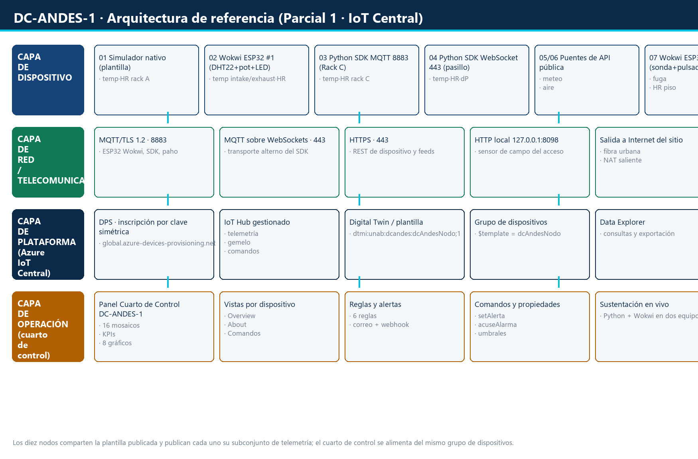

# Parcial 1 — Flota IoT heterogénea sobre Azure IoT Central

**Escenario 5.2 — Centro de datos** · *DC-ANDES-1* (AndesCloud S.A.S., Bucaramanga, Colombia)
Universidad Autónoma de Bucaramanga · IoT + Cloud + Sistemas Distribuidos · 2026-II



| | |
|---|---|
| **Aplicación IoT Central** | [`dcandes1unab`](https://dcandes1unab.azureiotcentral.com) |
| **Plantilla (Digital Twin)** | `Nodo DC-ANDES-1` · `dtmi:unab:dcandes:dcAndesNodo;1` — 42 capacidades, publicada |
| **Panel / cuarto de control** | *Cuarto de Control DC-ANDES-1* — 16 mosaicos: identidad, KPIs, 8 gráficos y alertas |
| **Ventana de métricas** | 4 fechas: 24, 25, 26 y 27 de septiembre de 2026 |
| **Flota** | 10 dispositivos · 10 orígenes de envío distintos · 6 intervalos de muestreo (15 s … 900 s) |
| **Documento del cliente** | [`informe/Informe_Parcial1_DC-ANDES-1.pdf`](informe/Informe_Parcial1_DC-ANDES-1.pdf) (18 pág.) |
| **Anexo de evidencias** | [`informe/Evidencias_Parcial1_DC-ANDES-1.pdf`](informe/Evidencias_Parcial1_DC-ANDES-1.pdf) (23 pág.) |

## Qué demuestra este proyecto

Un centro de datos urbano instrumentado de punta a punta sobre Azure IoT Central: **diez dispositivos
que no salen del mismo simulador**, sino de diez códigos o feeds distintos, publicando con intervalos
diferentes, con una desconexión real documentada y una ventana de métricas de cuatro fechas analizada
con máximo, mínimo, promedio, recuento y sumatoria.

Los tres puntos que se querían demostrar y cómo se resolvieron:

1. **Heterogeneidad de orígenes.** Cada fila del catálogo cambia código, feed o transporte: simulador
   nativo de la plataforma, dos ESP32 virtuales en Wokwi, SDK de Python por MQTT/TLS, el mismo SDK por
   WebSockets, un cliente paho con SAS firmado a mano, dos puentes de API pública, un replay de CSV
   histórico y un puente HTTP/REST con sensor de campo. La justificación de por qué cada uno es
   distinto está en [`docs/01-catalogo-dispositivos.md`](docs/01-catalogo-dispositivos.md).
2. **Asincronía y desconexión.** Seis intervalos distintos conviven en la misma flota (15, 30, 45, 60,
   120 y 900 s) y hay una pausa programada del nodo de humo que deja un hueco en la serie y el estado
   *Desconectado* en Central. Además, la ventana registró **cuatro incidentes reales** de operación
   distribuida (migración de la flota a un servidor Ubuntu a mitad de la ventana, doble publicación,
   rechazo de SAS del ESP32 y saturación de la cola de compilación de Wokwi): los cuatro están
   documentados con diagnóstico y resolución en la sección 6.1 del informe.
3. **Análisis de cuatro fechas.** 35 h 38 min registradas en total, con la comparativa completa por
   variable y la lectura operativa de cada extremo (qué situación del centro de datos explica cada
   máximo y cada mínimo).

## Los 10 dispositivos y su origen

| # | ID en Central | Zona | Origen de envío (código/feed) | Transporte | Intervalo |
|---|---|---|---|---|---|
| 01 | `DC-RACKA-01` | Rack A | Simulador nativo de la plantilla (Digital Twin) | plataforma | ~60 s |
| 02 | `DC-RACKB-02` | Rack B | ESP32 virtual #1 en Wokwi (Arduino + PubSubClient) | MQTT/TLS 8883 + DPS | 15 s |
| 03 | `DC-RACKC-03` | Rack C | Python con SDK `azure-iot-device` | MQTT/TLS 8883 + DPS | 30 s |
| 04 | `DC-PASILLO-04` | Pasillo frío | Python con SDK, transporte alterno | MQTT sobre WebSockets 443 | 60 s |
| 05 | `DC-CLIMA-05` | Clima exterior | API pública meteorológica (Open-Meteo) | HTTPS + MQTT/TLS | 900 s |
| 06 | `DC-AIRE-06` | Calidad de aire | API pública de otro dominio (Open-Meteo Air Quality) | HTTPS + REST 443 | 900 s |
| 07 | `DC-AGUA-07` | Agua bajo piso | ESP32 virtual #2 en Wokwi (sonda + pulsador) | MQTT/TLS 8883 + DPS | 30 s |
| 08 | `DC-HUMO-08` | Humo / incendio | Cliente MQTT explícito (paho, sin SDK, SAS a mano) | MQTT/TLS 8883 | 45 s |
| 09 | `DC-ENERGIA-09` | PDU / energía | Replay de un CSV histórico de la fila | MQTT/TLS 8883 | 120 s |
| 10 | `DC-ACCESO-10` | Puerta / acceso | Puente HTTP/REST + sensor de campo | HTTP local + MQTT/TLS | 120 s |

## Resultado de la ventana de 4 fechas

| Fecha | Ventana con datos | Horas | De dónde salieron los datos |
|---|---|---|---|
| 24-sep (jue) | 14:04 → 20:05 | 6 h 01 | 7 nodos en el portátil + los 2 ESP32 de Wokwi |
| 25-sep (vie) | 15:37 → 23:59 | 8 h 22 | 7 nodos en el portátil |
| 26-sep (sáb) | 00:00 → 18:09 | 18 h 09 | portátil hasta 15:22 y después el servidor Ubuntu |
| 27-sep (dom) | 10:28 → 15:00 | 4 h 32 | **solo** el servidor Ubuntu (7 nodos) + el ESP32 del Rack B |
| **Total** | | **35 h 38** | 14 414 muestras |

Cobertura por dispositivo: **[`datos/matriz_data_explorer.json`](datos/matriz_data_explorer.json)** — 9 de
los 10 dispositivos publicaron las cuatro fechas; `DC-AGUA-07` no lo hizo el 25 ni el 27 (la simulación
de Wokwi no llegó a publicar / no arrancó), y eso queda declarado en el anexo.

## Estructura del repositorio

```
docs/          Documentación de ingeniería
  01-catalogo-dispositivos.md     catálogo único de las 10 filas + por qué cada origen es distinto
  02-datasheets-y-parametros.md   por variable: datasheet, rango, precisión, valor en el código, umbral de regla
  03-arquitectura.md              arquitectura por capas con la capa de telecomunicaciones explícita
  04-ventana-4-dias.md            las 4 fechas: horas, comparativa por variable y lectura operativa
  05-operacion.md                 rutina diaria, modo servidor remoto, reconstrucción de los ESP32, costo
  bitacora-dia-1..4.md            bitácora real de cada fecha, con incidencias y cómo se resolvieron

dispositivos/
  python/      dc_comun.py               utilidades comunes (SAS, bitácora CSV, modelos por zona)
               dc_sdk_mqtt.py            Rack C    · SDK MQTT/TLS
               dc_sdk_ws.py              Pasillo   · SDK sobre WebSockets
               dc_paho.py                Humo      · paho con SAS firmado a mano
               dc_api_openmeteo.py       Clima     · API pública
               dc_api_aire.py            Aire      · API pública de otro dominio
               dc_csv_replay.py          Energía   · replay de CSV histórico
               dc_http_bridge.py         Acceso    · puente HTTP → MQTT
               dc_acceso_sim.py          sensor de campo del acceso
               dc_supervisor.py          supervisor de la flota en el portátil
               dc_supervisor_remote.py   supervisor para el servidor Ubuntu (una entrada por script)
  wokwi/rackb/  sketch.ino, diagram.json, libraries.txt, secrets.h.example
  wokwi/agua/   sketch.ino, diagram.json, libraries.txt, secrets.h.example

tools/         despliegue, evidencias y generación de documentos
  fetch_creds.py            obtiene ID Scope y claves de IoT Central (az CLI) — nunca las escribe en el repo
  deploy_remote.sh          despliega la flota en el servidor Ubuntu
  comparativa_4dias.py      calcula máx/mín/promedio/recuento/sumatoria de las 4 fechas
  build_informe.py          genera el informe del cliente (.docx)
  build_evidencias.py       genera el anexo de evidencias (.docx)
  diagrama_arquitectura.py  dibuja el diagrama por capas con los 10 orígenes
  shot.py / shot_tab.py     capturas del portal (la segunda no navega: protege los proyectos Wokwi)
  ocr_audit.py              auditoría de secretos sobre las imágenes (OCR) antes de publicar
  backup.py                 empaqueta el proyecto en un ZIP sin credenciales

datos/         series CSV por dispositivo (locales y rescatadas del servidor)
evidencias/    capturas del portal, de los monitores serie y el diagrama
informe/       informe del cliente y anexo de evidencias, en .docx y .pdf
assets/        identidad visual del escenario (logo)
```

## Cómo se ejecuta

```bash
# 1) entorno (Python 3.11)
uv venv --python 3.11 .venv
uv pip install --python .venv/Scripts/python.exe azure-iot-device paho-mqtt requests pandas matplotlib python-docx openpyxl

# 2) credenciales: se piden a Azure, nunca se escriben en el repositorio
python tools/fetch_creds.py            # deja .secrets/env/<device>.env (ignorado por git)

# 3) flota completa en el portátil (8 nodos + supervisor)
python dispositivos/python/dc_supervisor.py --estado
tools/start_supervisor.cmd

# 4) modo servidor remoto (los 7 nodos Python en una VM Ubuntu)
bash tools/deploy_remote.sh <usuario>@<host>
ssh -i <llave>.pem <usuario>@<host> \
  "cd ~/Parcial1_IoT_Central && setsid nohup ~/venv_parcial/bin/python3 \
   dispositivos/python/dc_supervisor_remote.py > logs/supervisor.log 2>&1 < /dev/null &"

# 5) los dos ESP32 virtuales: se abren los proyectos de Wokwi en el navegador
#    (procedimiento paso a paso en docs/05-operacion.md)

# 6) apagado limpio y copia de seguridad
powershell -NoProfile -File tools/apagar_flota.ps1
python tools/backup.py
```

## Seguridad y manejo de credenciales

Este repositorio es **público**, así que las credenciales se manejan fuera de él:

- Las claves de dispositivo viven en `.secrets/env/<device>.env` y se obtienen con
  `tools/fetch_creds.py`; `.secrets/`, `*.env`, `secrets.h` y `*.pem` están en `.gitignore`.
- Los sketches de Wokwi incluyen solo `secrets.h.example`; el archivo real se genera en local.
- Los payloads que se inyectan en Wokwi (`tools/js/wokwi_*_payload.js`) llevan el `secrets.h`
  incrustado en base64, así que **están ignorados por git y se generan en cada sesión**.
- Antes de publicar se ejecutó una auditoría de tres capas (texto, OCR de las imágenes y artefactos
  derivados) y se **reescribió el historial de git** para eliminar dos payloads que llegaron a
  contener una clave real de dispositivo; también se retiraron los registros de consola del navegador.
  La auditoría se puede repetir con `python tools/ocr_audit.py`.
- Las capturas del portal no muestran claves ni cadenas de conexión: se revisó por OCR.

## Decisiones de diseño

1. **Un solo catálogo de 10 filas con 10 orígenes distintos.** Sin bloques fijos ni dispositivos de
   relleno: el simulador nativo cubre una fila y los dos ESP32 cubren otras dos.
2. **Una sola plantilla** para los diez dispositivos, de modo que el panel y las reglas comparen
   variables con la misma semántica. Cada nodo publica solo el subconjunto de su zona.
3. **Asincronía deliberada**: seis intervalos distintos; el intervalo declarado viaja en la propiedad
   `intervaloMuestreo` de cada gemelo.
4. **Desconexión documentada**: pausa programada del nodo de humo, más los cuatro incidentes reales
   de la ventana.
5. **Lo que solo existe en la interfaz se hace en la interfaz** (vistas, reglas, panel,
   personalización) y lo repetible se automatiza por API/CLI (plantilla, dispositivos, credenciales).
6. **Toda variable tiene explicación**: las que no vienen de un feed público se generan con modelos
   físicos simples documentados por variable, de forma que cada extremo de la comparativa se pueda
   explicar operativamente.

## Reglas configuradas en la aplicación

| # | Regla | Condición | Acción |
|---|---|---|---|
| 1 | Alerta temperatura de rack | `tempExhaust > 35 °C` | correo al operador |
| 2 | Alerta humedad de rack | `humedadRack > 60 %HR` | correo al operador |
| 3 | Humo detectado en sala | `humo > 0,08 %obs/m` | correo al operador |
| 4 | Calidad de aire degradada | `pm25 > 35 µg/m³` | correo al operador |
| 5 | Alerta humedad en piso técnico | `humedadPiso > 70 %` | correo al operador |
| 6 | Exceso de eventos de acceso | `eventosAcceso > 20` | correo al operador |

Las condiciones usan telemetrías numéricas a propósito: el umbral queda trazable al datasheet de la
variable (anexo A del informe) y se puede reproducir en la sustentación.

## Modelos y supuestos

- Las variables **reales** provienen de los feeds públicos (Open-Meteo y Open-Meteo Air Quality) y de
  los CSV históricos de la PDU.
- Las variables sin fuente pública (temperaturas de racks, presión diferencial, humo, acceso) se
  generan con **modelos físicos simples** documentados por variable en
  `docs/02-datasheets-y-parametros.md` (valor base, amplitud, offset y ruido).
- El **simulador nativo** de IoT Central no permite fijar rangos: produce valores aleatorios 0-100.
  Por eso las comparativas térmicas usan los racks B y C (sensores modelados) y el Rack A se muestra
  aparte, etiquetado como simulador nativo.

## Limitaciones encontradas

- El plan gratuito de Wokwi tiene una **cola de compilación** que, con dos proyectos abiertos a la vez,
  puede impedir arrancar una simulación (ocurrió el 27-sep con el nodo de agua; verificado que no era
  un problema del sketch probando uno nuevo desde cero).
- El SAS del hub caduca cada hora: los sketches renuevan el token al reconectar y se les añadió
  resincronización de hora y reinicio automático tras rechazos persistentes (`rc=4/5`).
- Las reglas y los mosaicos del panel no tienen API pública estable en IoT Central; se configuran por
  la interfaz.

## Autoría

Marcos Valera Daza — Universidad Autónoma de Bucaramanga, IoT + Cloud + Sistemas Distribuidos, 2026-II.
Trabajo académico; el escenario, la plantilla y la flota son ficticios y no contienen datos reales de
ninguna instalación.
